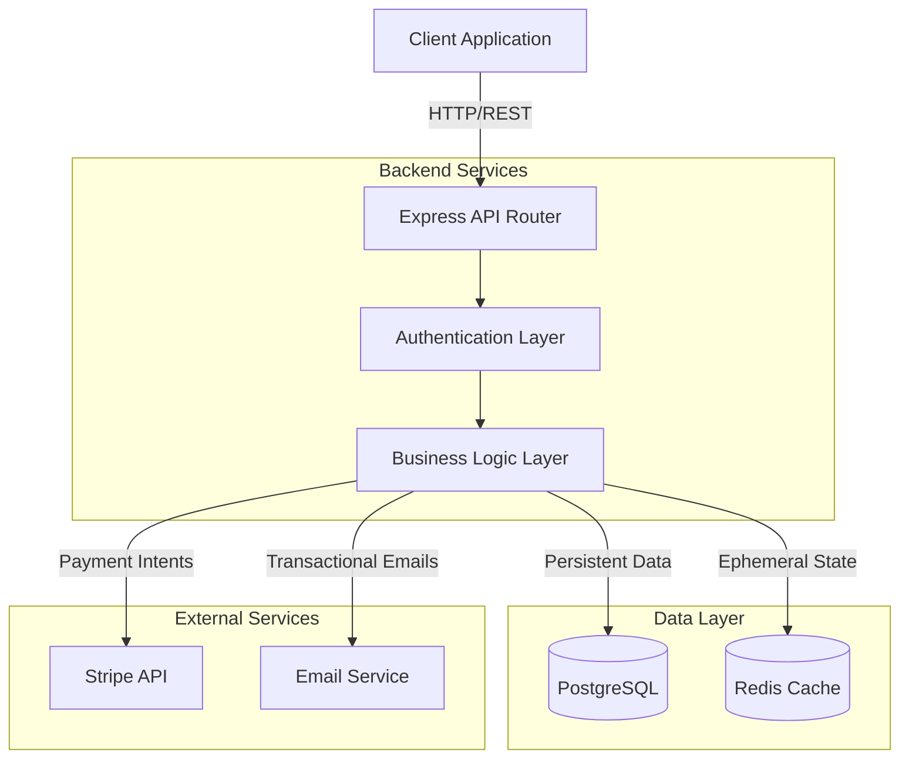
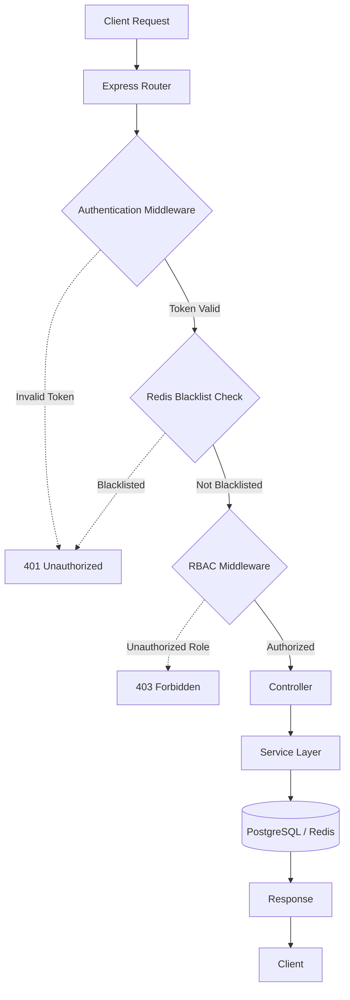
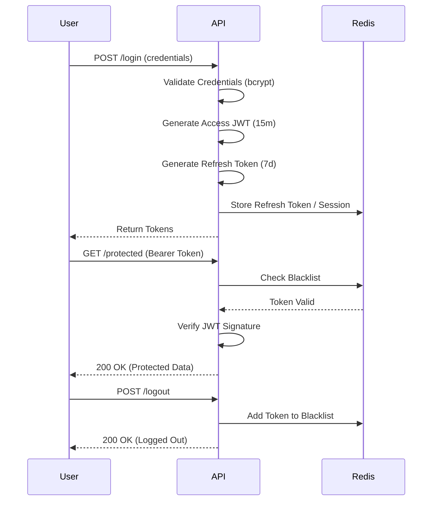
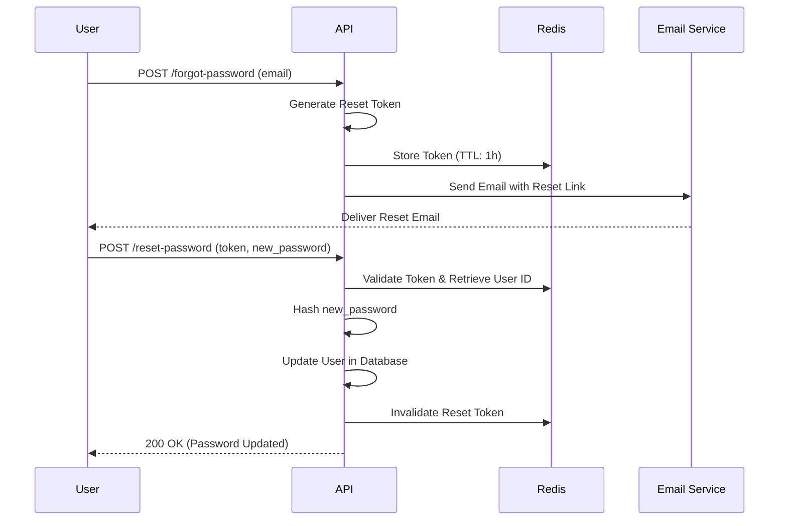
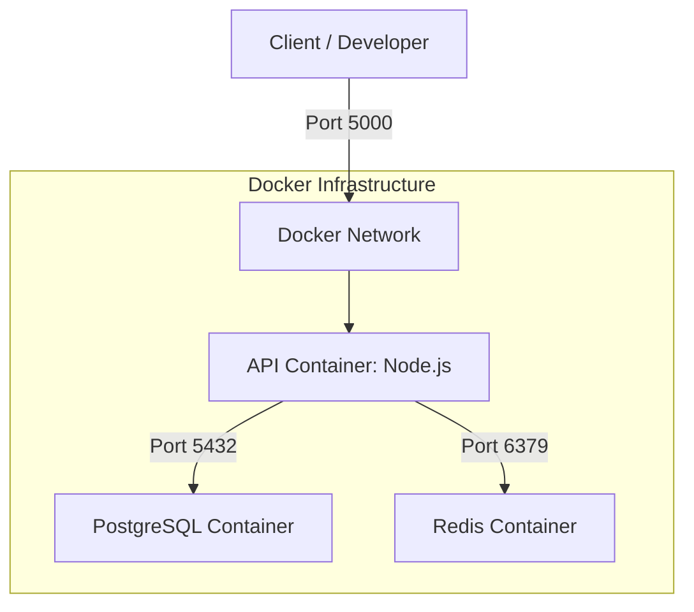
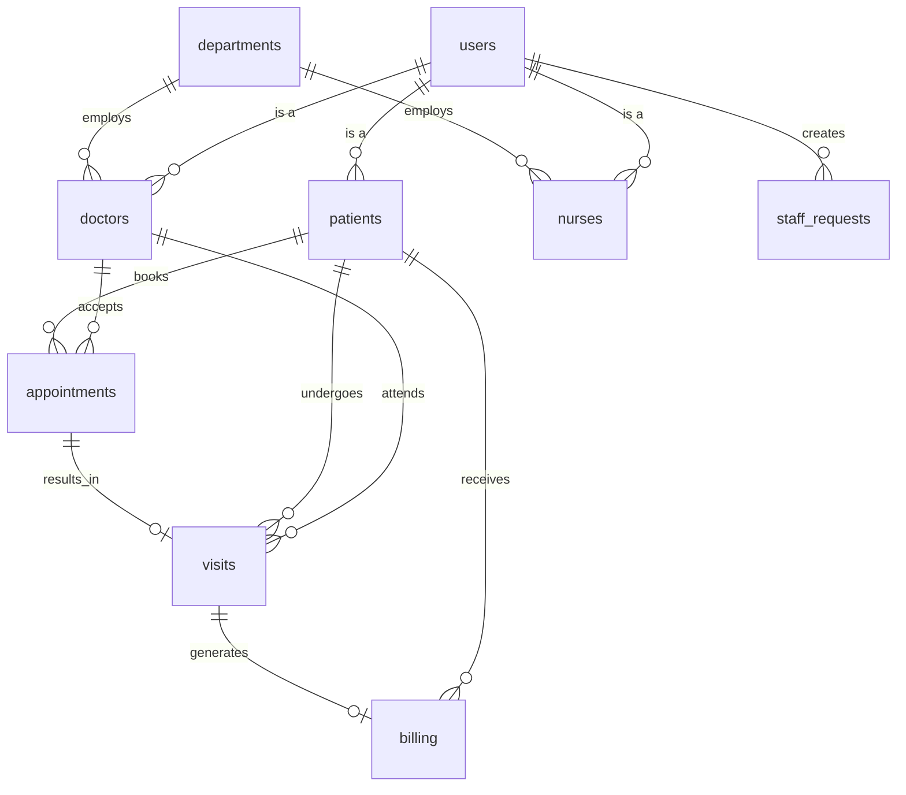

# 🏥 Hospital Management System


A comprehensive, RESTful backend system for managing hospital operations — including patient records, doctor assignments, appointment scheduling, visit tracking, and billing. Built with a security-first architecture featuring Redis-backed JWT session management and role-based access control.

---

## Table of Contents

- [Features](#features)
- [Tech Stack](#tech-stack)
- [Architecture Overview](#architecture-overview)
- [Installation](#installation)
- [Running with Docker](#running-with-docker)
- [Usage](#usage)
- [Environment Variables](#environment-variables)
- [Project Structure](#project-structure)
- [Database Schema](#database-schema)
- [API Reference](#api-reference)
- [Screenshots / Demo](#screenshots--demo)
- [Contributing](#contributing)
- [Contact](#contact)

---

## Features

- **Role-Based Access Control (RBAC)** — Distinct roles for `admin`, `doctor`, `nurse`, and `patient` with route-level enforcement
- **JWT Authentication with Token Rotation** — Short-lived access tokens (15m) and long-lived refresh tokens (7d)
- **Redis-Backed Token Blacklisting** — Revoked tokens are instantly invalidated at the middleware layer without database lookups
- **Redis Session & Token Storage** — Password reset and email verification tokens stored ephemerally with TTL; no sensitive data persists in the database
- **Appointment & Visit Management** — Full lifecycle from scheduling to diagnosis and treatment recording
- **Billing & Stripe Integration** — Invoice generation, payment status tracking, and Stripe payment intent support
- **Staff Request Workflow** — Doctors and nurses can submit operational requests for admin review
- **Email Notifications** — Transactional emails via Nodemailer (password reset, appointment confirmations)
- **Input Validation** — All inputs validated with Zod schemas before reaching business logic
- **Health Check Endpoint** — Liveness probe for container orchestration and uptime monitoring
- **Containerized Deployment** — Multi-stage Docker build with Docker Compose for zero-configuration local and production environments
- **Database Migrations** — Version-controlled schema evolution with Knex.js

## Security Features

- **JWT Authentication** — Stateless authentication using short-lived access tokens.
- **Refresh Token Rotation** — Long-lived refresh tokens stored securely to issue new access tokens without requiring re-authentication.
- **Redis Token Blacklisting** — Revoked or logged-out tokens are immediately added to a Redis blacklist to prevent unauthorized access.
- **Role-Based Access Control (RBAC)** — Strict authorization checks at the route level to ensure users only access permitted resources based on their role (`admin`, `doctor`, `nurse`, `patient`).
- **Password Hashing with bcrypt** — Passwords are securely hashed and salted before storage.
- **Zod Validation** — Rigorous runtime type checking and input sanitization on all incoming request payloads.
- **Environment Variable Isolation** — Sensitive secrets and configuration are kept out of the codebase using `.env` files.
- **Token Expiration Policies** — Ephemeral data (like password reset and email verification tokens) is configured with strict Time-To-Live (TTL) values in Redis.

---

## Tech Stack

| Layer | Technology |
|---|---|
| **Runtime** | Node.js + TypeScript |
| **Framework** | Express.js v5 |
| **Database** | PostgreSQL 16 |
| **ORM / Query Builder** | Knex.js v3 |
| **Cache / Session Store** | Redis 7 (via ioredis) |
| **Authentication** | JSON Web Tokens (jsonwebtoken) |
| **Password Hashing** | bcrypt |
| **Validation** | Zod |
| **Email** | Nodemailer |
| **Payments** | Stripe |
| **Testing** | Jest + Supertest |
| **Containerization** | Docker + Docker Compose |

---

## Architecture Overview



The system employs a layered architecture separating concerns between routing, authentication, business logic, and data access. Redis acts as a high-speed cache for session state and blacklists, while PostgreSQL serves as the primary source of truth for persistent business records.

### Request Lifecycle



### Authentication Flow



### Password Reset Flow



---

## Installation

### Prerequisites

- Node.js >= 20
- PostgreSQL >= 16
- Redis >= 7
- npm >= 10

### Steps

```bash
# 1. Clone the repository
git clone https://github.com/your-username/hospital-management-system.git
cd hospital-management-system

# 2. Install dependencies
npm install

# 3. Configure environment variables
cp .env.example .env
# Open .env and fill in your values (see Environment Variables section)

# 4. Run database migrations
npx knex migrate:latest --knexfile knexfile.ts

# 5. (Optional) Seed the database
npm run seed

# 6. Start the development server
npm run dev
```

The server will start on `http://localhost:5000`.

---

## Running with Docker

The entire stack (app + PostgreSQL + Redis) can be spun up with a single command within an isolated Docker network.



```bash
# 1. Copy and configure the environment file
cp .env.example .env

# 2. Build and start all services
docker compose up --build

# 3. To run in detached mode
docker compose up --build -d

# 4. To tear down and remove volumes
docker compose down -v
```

> **Note:** The application container will wait for PostgreSQL and Redis to pass their healthchecks before starting, and will automatically run database migrations on boot.

### Service Ports

| Service | Host Port | Container Port |
|---|---|---|
| API Server | `5000` | `5000` |
| PostgreSQL | `5433` | `5432` |
| Redis | `6379` | `6379` |

---

## Usage

### Development

```bash
# Start with hot-reload
npm run dev

# Run the test suite
npm test

# Run tests with coverage
npm run test:coverage

# Build for production
npm run build

# Start the production build
npm start
```

### Health Check

```bash
curl http://localhost:5000/health
# → { "status": "ok", "database": "connected" }
```

### Authenticating Requests

All protected endpoints require a valid Bearer token in the `Authorization` header:

```bash
curl -H "Authorization: Bearer <your_access_token>" \
     http://localhost:5000/api/patients
```

---

## Environment Variables

Copy `.env.example` to `.env` and configure each variable:

```bash
cp .env.example .env
```

| Variable | Description | Example |
|---|---|---|
| `NODE_ENV` | Application environment | `development` / `production` |
| `PORT` | HTTP server port | `5000` |
| `DB_HOST` | PostgreSQL host | `localhost` (local) / `db` (Docker) |
| `DB_PORT` | PostgreSQL port | `5432` |
| `DB_USER` | PostgreSQL username | `hospital_user` |
| `DB_PASSWORD` | PostgreSQL password | `your_strong_password` |
| `DB_NAME` | PostgreSQL database name | `hospital_db` |
| `REDIS_HOST` | Redis host | `localhost` |
| `REDIS_PORT` | Redis port | `6379` |
| `JWT_SECRET` | Secret for signing access tokens | 256-bit random string |
| `JWT_REFRESH_SECRET` | Secret for signing refresh tokens | 256-bit random string |
| `JWT_EXPIRES_IN` | Access token lifetime | `15m` |
| `JWT_REFRESH_EXPIRES_IN` | Refresh token lifetime | `7d` |
| `SMTP_HOST` | SMTP server host | `smtp.example.com` |
| `SMTP_PORT` | SMTP server port | `587` |
| `SMTP_USER` | SMTP username / sender address | `noreply@example.com` |
| `SMTP_PASS` | SMTP password | `your_smtp_password` |
| `STRIPE_SECRET_KEY` | Stripe API secret key | `sk_test_...` |
| `STRIPE_WEBHOOK_SECRET` | Stripe webhook signing secret | `whsec_...` |

> **Security:** Never commit your `.env` file. It is git-ignored by default.

---

## Project Structure

```
hospital-management-system/
├── migrations/                    # Knex database migrations (version-controlled schema)
│   ├── 20240101000000_initial_schema.ts
│   ├── 20260604012541_remove_doctor_id_from_nurses.ts
│   └── 20260604020713_refactor_tokens_to_redis.ts
│
├── src/
│   ├── config/
│   │   └── redis.ts               # ioredis client initialization
│   │
│   ├── middlewares/
│   │   └── auth.middleware.ts     # JWT protect middleware (Redis blacklist check)
│   │
│   ├── modules/                   # Feature modules (controller + service)
│   │   ├── auth/
│   │   │   ├── controllers/
│   │   │   │   └── auth.controller.ts
│   │   │   └── services/
│   │   │       └── auth.service.ts
│   │   ├── doctors/
│   │   ├── nurses/
│   │   ├── patients/
│   │   └── users/
│   │
│   ├── services/
│   │   └── redis.service.ts       # Redis abstraction (blacklist, token storage)
│   │
│   └── db.ts                      # Knex database connection instance
│
├── tests/                         # Integration & unit tests
│   ├── env.ts
│   └── setup.ts
│
├── dist/                          # Compiled production output (git-ignored)
├── Dockerfile                     # Multi-stage Docker build
├── docker-compose.yml             # Local/production container orchestration
├── knexfile.ts                    # Knex configuration (dev + production)
├── server.ts                      # Application entry point
├── tsconfig.json                  # TypeScript compiler configuration
├── .env.example                   # Environment variable template
└── package.json
```

---

## Database Schema



The schema is managed entirely through Knex migrations. Core tables:

```
users
  ├── id, name, email, password_hash
  ├── role: admin | doctor | nurse | patient
  └── is_active, created_at, updated_at

patients          ──► users (CASCADE)
  └── date_of_birth, blood_type, medical_history, phone, address

doctors           ──► users (CASCADE), departments (SET NULL)
  └── specialization, license_number, phone

nurses            ──► users (CASCADE), departments (SET NULL)

departments
  └── name, description

appointments      ──► patients, doctors
  └── scheduled_at, status: pending|confirmed|cancelled|completed, notes

visits            ──► appointments (SET NULL), patients, doctors
  └── visited_at, diagnosis, treatment

billing           ──► patients, visits (SET NULL)
  └── amount, status: pending|paid|refunded, stripe_payment_intent_id

staff_requests    ──► users
  └── request_type, description, status: pending|approved|rejected
```

> Ephemeral data (refresh tokens, password reset tokens, email verification tokens) is stored in **Redis** with TTL — not in the database.

---

## API Testing (Postman)

A complete Postman collection is available for testing the API endpoints, including pre-configured environment variables for authentication and routing.

1. Navigate to the `/docs` or `/postman` folder in this repository.
2. Import the `Hospital_Management_System.postman_collection.json` file into Postman.
3. Import the `Hospital_Management_System_Local.postman_environment.json` environment file.
4. Set the environment as active, register a user, log in to receive your JWT, and set it as your `Bearer Token` for subsequent requests.

---

## API Reference

### Authentication

| Method | Endpoint | Auth | Description |
|---|---|---|---|
| `POST` | `/api/auth/register` | ❌ | Register a new user |
| `POST` | `/api/auth/login` | ❌ | Login and receive access + refresh tokens |
| `POST` | `/api/auth/logout` | ✅ Bearer | Blacklist current token, invalidate session |
| `POST` | `/api/auth/refresh` | ❌ | Exchange refresh token for new access token |
| `POST` | `/api/auth/forgot-password` | ❌ | Send password reset email |
| `POST` | `/api/auth/reset-password` | ❌ | Reset password using token from email |

### Users

| Method | Endpoint | Auth | Description |
|---|---|---|---|
| `GET` | `/api/users/me` | ✅ Bearer | Get currently authenticated user's profile |
| `PATCH` | `/api/users/me` | ✅ Bearer | Update profile details |

### Patients

| Method | Endpoint | Auth | Role |
|---|---|---|---|
| `GET` | `/api/patients` | ✅ | admin, doctor |
| `GET` | `/api/patients/:id` | ✅ | admin, doctor, patient (own) |
| `POST` | `/api/patients` | ✅ | admin |
| `PATCH` | `/api/patients/:id` | ✅ | admin, patient (own) |

### Doctors

| Method | Endpoint | Auth | Role |
|---|---|---|---|
| `GET` | `/api/doctors` | ✅ | All authenticated |
| `GET` | `/api/doctors/:id` | ✅ | All authenticated |
| `POST` | `/api/doctors` | ✅ | admin |
| `PATCH` | `/api/doctors/:id` | ✅ | admin, doctor (own) |

### Appointments

| Method | Endpoint | Auth | Description |
|---|---|---|---|
| `GET` | `/api/appointments` | ✅ | List appointments (filtered by role) |
| `POST` | `/api/appointments` | ✅ | Book a new appointment |
| `PATCH` | `/api/appointments/:id` | ✅ | Update appointment status |
| `DELETE` | `/api/appointments/:id` | ✅ | Cancel appointment |

### Billing

| Method | Endpoint | Auth | Description |
|---|---|---|---|
| `GET` | `/api/billing` | ✅ | List billing records |
| `GET` | `/api/billing/:id` | ✅ | Get billing record |
| `POST` | `/api/billing/:id/pay` | ✅ | Initiate Stripe payment |

### System

| Method | Endpoint | Auth | Description |
|---|---|---|---|
| `GET` | `/health` | ❌ | Database liveness probe |
| `GET` | `/` | ❌ | API info and version |

---

## Screenshots / Demo

> Screenshots and a live demo will be added upon deployment.

```
[ Login Flow ]          → POST /api/auth/login → JWT issued → Redis session
[ Appointment Booking ] → POST /api/appointments → doctor + patient linked
[ Billing + Stripe ]    → POST /api/billing/:id/pay → Stripe payment intent
[ Admin Dashboard ]     → Role-gated views per user type
```

---

## Contributing

Contributions are welcome. Please follow these steps:

1. **Fork** the repository
2. **Create** a feature branch: `git checkout -b feature/your-feature-name`
3. **Commit** your changes with a descriptive message: `git commit -m "feat: add appointment reminders"`
4. **Push** to your branch: `git push origin feature/your-feature-name`
5. **Open** a Pull Request against `main`

### Code Style

- All code is written in **TypeScript** — no `any` types without justification
- Follow the existing module structure: `controllers/` → `services/` → `db`
- Input validation must use **Zod** schemas
- All new endpoints must have corresponding **Jest** integration tests

### Commit Convention

This project follows [Conventional Commits](https://www.conventionalcommits.org/):

```
feat:     A new feature
fix:      A bug fix
refactor: Code change that neither fixes a bug nor adds a feature
test:     Adding or updating tests
chore:    Build process, dependency updates
docs:     Documentation changes
```

---

## Contact

For questions, feedback, or collaboration:

- **GitHub:** [@BODA20](https://github.com/BODA20)
- **Email:** boda.saber.dev@gmail.com
- **LinkedIn:** [Abdelrahman Fattouh](https://www.linkedin.com/in/abdelrahman-fattouh-1165bb407)

---

<p align="center">Built with care for healthcare infrastructure reliability and security.</p>
